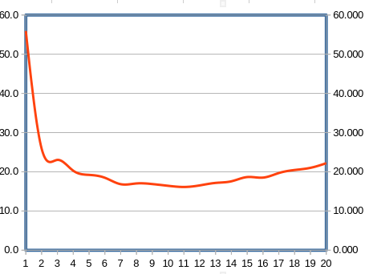

# CBDP - Report Assignment 4

> Ivan Logvynenko
> Ludovico Capiaghi
> Natalie Schroll 

## 1. Design Questions

- ### How does the leader process know the number of alive workers?

  In our solution the number of active workers is represented by the number of open socket with whom the coordinator is communicating. Our number of workers can scale up (new workers shows up) and down (a worker disconnect, for example because it fails) dynamically at runtime.

- ### How can we distribute work "fairly" among workers?

  In our solution we assign new task to the first worker available. In particular, if we still have tasks to be done we assign a task to the worker when he shows up (open a connection), then when it's done(reports a correct answer) he immediately receives a new one (if we still have tasks to complete). 

  For our solution to distribute work "fairly" (considering a fair distribution of tasks to be $\frac{1}{N}\sum_{i=0}^{N}n_{i} \sim \frac{n_{tasks}}{N}$, wher  $n_{i}$ is the number of tasks solved by the worker *i*) among workers we have to assume a fair scheduling of the worker. In fact, with a not fair execution time for every worker, our solution would prefer the fastest workers (possibly the ones with a longer, on average, execution time). We decided to opt for this solution  because:

  - it guarantees better performances compared to a "strict fair distribution" in case of a not fair execution time for every worker
  - empirically, modern scheduler perform a good fair scheduling (as is the case of our test environment, a single machine with Linux OS)
  
- ### With what messages do leader - worker communicate?

  The leader-worker communication is based on the exchange of strings (tasks from coordinator to worker), number (results from worker to coordinator) and interpreting socket connection status (part of this explained in the next answer). 

  Giving more details:

  - the coordinator sends tasks to the workers using a single string. This string represent the URL of a chunk of the partitioned data we're querying. 
  - the worker sends back to coordinator a single number. This number, an integer represent the result of our query execution on the last task (chunk of data) sent to the worker.
  - when leader closes  the connection toward a worker w, then w knows that he can terminate.

- ### How can we detect failed / crashed workers?

  We handle two types of worker fault:

  - complete disconnection
  - node unresponsive for some time

  So by monitoring the events on the sockets opened with the workers, the coordinator knows which worker has failed/crashed.

- ### How do we recover when a worker fails?

  The coordinator keeps track of which task being performed by a worker (association between file descriptor and task). So when the coordinator detects that a certain worker has failed (as described in the previous answer) he knows also which task *t* has not been completed and can re-add t to the tasks to do.

## 2. Scalability Questions

- ### What is the limit in scaling? (network, CPU-bound)
    Potentially there is no limit in scaling, because the system will be working. Main problem, however is how fast it will be working. With more CPU we would be able to supprot more workers, but at a certain point of time we might reach maximum amount of socket descriptors or it would be so much workers, that iterating through the list of socket descriptors would take more time that the worker needs to finish the task, so they will be waiting for coordinator to finish. After some performance tests for different amount of workers on 11th Gen Intel® Core™ i7-11800H × 16(stating processor is important, because of the amount of cores, that allow more workers to rum simultaneously) we can state that 11 workers is optimal for this processor.
    
    The following graphic reports the execution time for the *workload test* depending on the number of workers used.
    
    
    
- ### Measure each worker’s load - how is load balancing affected by scale?

    After scaling it is getting larger to divide work between workers equally. By taking optimal value of 11 workers we get the result where the difference of solved tasks by each worker and average amount of tasks that each worker should solve isn't more then 2. On the other hand if we recount numbers in persents and take them for every amount of workers in the range of 1 to 20 then we would see exponential grows of this difference. That is why in our opinion load balancing is affected negatively by scaling.

- ### Could you think of a case when the coordinator would become a bottleneck in such a system?
  
    Coordinator can be a bottleneck in this system in various cases. Firstly, if we have too much workers, then we would have to spend a lot of time to process every worker. Secondly, if we have a lot more complicated preprocess work, and not just getting a string and passing it to worker, it might take way more resources, and in some case coordinator might fail.